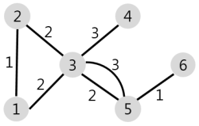
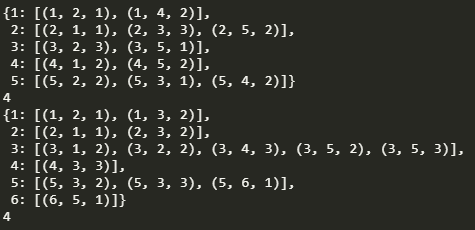

# 배달

###### 문제 설명

N개의 마을로 이루어진 나라가 있습니다. 이 나라의 각 마을에는 1부터 N까지의 번호가 각각 하나씩 부여되어 있습니다. 각 마을은 양방향으로 통행할 수 있는 도로로 연결되어 있는데, 서로 다른 마을 간에 이동할 때는 이 도로를 지나야 합니다. 도로를 지날 때 걸리는 시간은 도로별로 다릅니다. 현재 1번 마을에 있는 음식점에서 각 마을로 음식 배달을 하려고 합니다. 각 마을로부터 음식 주문을 받으려고 하는데, N개의 마을 중에서 K 시간 이하로 배달이 가능한 마을에서만 주문을 받으려고 합니다. 다음은 N = 5, K = 3인 경우의 예시입니다.


위 그림에서 1번 마을에 있는 음식점은 [1, 2, 4, 5] 번 마을까지는 3 이하의 시간에 배달할 수 있습니다. 그러나 3번 마을까지는 3시간 이내로 배달할 수 있는 경로가 없으므로 3번 마을에서는 주문을 받지 않습니다. 따라서 1번 마을에 있는 음식점이 배달 주문을 받을 수 있는 마을은 4개가 됩니다.
마을의 개수 N, 각 마을을 연결하는 도로의 정보 road, 음식 배달이 가능한 시간 K가 매개변수로 주어질 때, 음식 주문을 받을 수 있는 마을의 개수를 return 하도록 solution 함수를 완성해주세요.

##### 제한사항

- 마을의 개수 N은 1 이상 50 이하의 자연수입니다.
- road의 길이(도로 정보의 개수)는 1 이상 2,000 이하입니다.
- road의 각 원소는 마을을 연결하고 있는 각 도로의 정보를 나타냅니다.
- road는 길이가 3인 배열이며, 순서대로 (a, b, c)를 나타냅니다.
  - a, b(1 ≤ a, b ≤ N, a != b)는 도로가 연결하는 두 마을의 번호이며, c(1 ≤ c ≤ 10,000, c는 자연수)는 도로를 지나는데 걸리는 시간입니다.
  - 두 마을 a, b를 연결하는 도로는 여러 개가 있을 수 있습니다.
  - 한 도로의 정보가 여러 번 중복해서 주어지지 않습니다.
- K는 음식 배달이 가능한 시간을 나타내며, 1 이상 500,000 이하입니다.
- 임의의 두 마을간에 항상 이동 가능한 경로가 존재합니다.
- 1번 마을에 있는 음식점이 K 이하의 시간에 배달이 가능한 마을의 개수를 return 하면 됩니다.

------

##### 입출력 예

| N    | road                                                      | K    | result |
| ---- | --------------------------------------------------------- | ---- | ------ |
| 5    | [[1,2,1],[2,3,3],[5,2,2],[1,4,2],[5,3,1],[5,4,2]]         | 3    | 4      |
| 6    | [[1,2,1],[1,3,2],[2,3,2],[3,4,3],[3,5,2],[3,5,3],[5,6,1]] | 4    | 4      |

##### 입출력 예 설명

입출력 예 #1
문제의 예시와 같습니다.

입출력 예 #2
주어진 마을과 도로의 모양은 아래 그림과 같습니다.

1번 마을에서 배달에 4시간 이하가 걸리는 마을은 [1, 2, 3, 5] 4개이므로 4를 return 합니다.


### Code

```python
from collections import deque
# from pprint import pprint

def search(graph,weight,K):
    q = deque([])
    q.append(graph[1])
    while q:
        next_node = q.popleft()
        for start,dest,wei in next_node:
            if weight[dest] > weight[start]+wei:
                weight[dest] = weight[start]+wei
                q.append(graph[dest])
            else:
                continue
    return len([x for x in weight[1:] if x<=K])


def solution(N,road,K):
    graph = {}
    
    # initialize Graph
    for s,d,w in road:
        if s not in graph:
            graph[s] = [(s,d,w)]
        else:
            graph[s].append((s,d,w))
        
        if d not in graph:
            graph[d] = [(d,s,w)]
        else:
            graph[d].append((d,s,w))
    
    # pprint(graph)

    glen = len(graph)
    weight = [float("inf") if i>1 else 0 for i in range(glen+1)]
    
    return search(graph,weight,K)
```


### Solution

간단한 다익스트라 문제

모든 간선을 우선 인접리스트 형태로 만들었다.


이 리스트를 기준으로 각 노드별 weight를 담은 `weight` 변수를 선언하고 `[0,inf,inf....]` 로 초기화를 시켜주었다.

그리고 `BFS` 처럼 알고리즘이 수행되는데, `현재 선택된 노드의 가중치 + 다음 노드까지 가는데의 가중치` 가 ` 다음노드가 가지고있는 가중치` 보다 작으면 해당 루트가 가장 Shortest 하므로 가중치를 변경한다.

최종적으로 가중치가 업데이트 됐다면 `K` 보다 작은 가중치들의 개수를 반환한다.


`+4`

