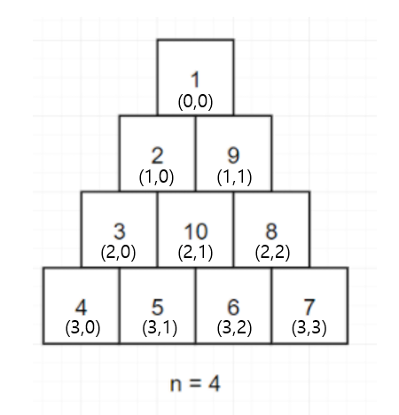

# 삼각 달팽이

## 접근 방식

* 우선 전체 배열의 크기를 구한다

  * 전체 배열의 크기 == size(n) = size(n-1) + n

    ```python
    def getSize(n):
        dp = [0 for _ in range(n+1)]
        dp[1] = 1
        for i in range(2,n):
            dp[i] = dp[i-1] + i
        return dp[n]
    ```

  * 라고 생각했는데 전혀 안됨


### 해답

* 경우의 수를 3가지로 나눈다
  * y 가 증가 , number + 1 , n -=1
  * x 가 증가 , number + 1 , n -= 1
  * y,x가 감소 , number + 1 , n -= 1




* 1번째 경우 (y 증가)
  * 0,0 --> 1,0 --> 2,0 --> 3,0 (size = 4)
  * 여기서 n -=1 을 해줘야 5,6,7 순으로 들어갈 수 있다
  * 매번 size == 0이 되면 break가 되도록 체크
* 2번째 경우 (x 증가)
  * 3,1 --> 3,2 --> 3,3 (size = 3)
* 3번째 경우 (y,x 감소)
  * 2,2 --> 1,1 (size = 2)

> 이 경우의 수들을 while 로 반복한다

반복 시 y,x는 2,1을 가리키고  size는 1 --> 0 이 되므로 종료

### Time complexity

O(n^2) 라고 생각한다.