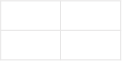
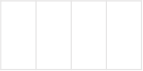
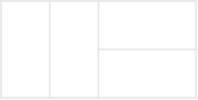
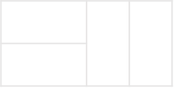
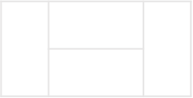
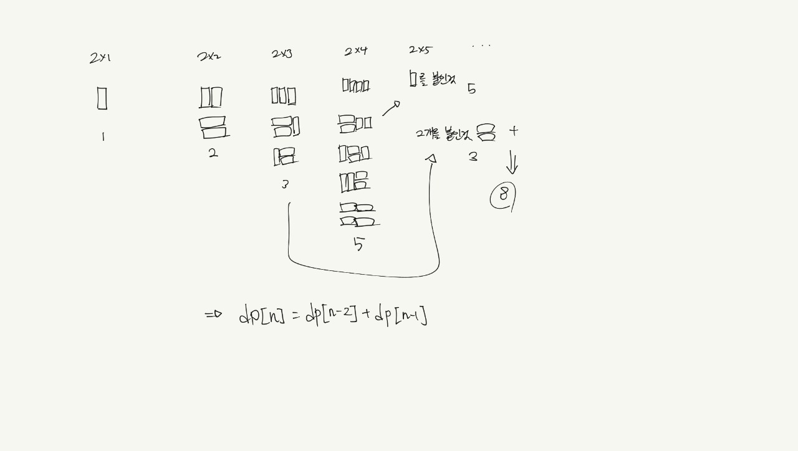

# 2 x n 타일링

###### 문제 설명

가로 길이가 2이고 세로의 길이가 1인 직사각형모양의 타일이 있습니다. 이 직사각형 타일을 이용하여 세로의 길이가 2이고 가로의 길이가 n인 바닥을 가득 채우려고 합니다. 타일을 채울 때는 다음과 같이 2가지 방법이 있습니다.

- 타일을 가로로 배치 하는 경우
- 타일을 세로로 배치 하는 경우

예를들어서 n이 7인 직사각형은 다음과 같이 채울 수 있습니다.


직사각형의 가로의 길이 n이 매개변수로 주어질 때, 이 직사각형을 채우는 방법의 수를 return 하는 solution 함수를 완성해주세요.

##### 제한사항

- 가로의 길이 n은 60,000이하의 자연수 입니다.
- 경우의 수가 많아 질 수 있으므로, 경우의 수를 1,000,000,007으로 나눈 나머지를 return해주세요.

------

##### 입출력 예

| n    | result |
| ---- | ------ |
| 4    | 5      |

##### 입출력 예 설명

입출력 예 #1
다음과 같이 5가지 방법이 있다.











### Code

```python
def solution(n):
    pre2 = 1
    pre1 = 2
    for i in range(3,n+1):
        next_ = pre2+pre1
        pre2,pre1 = pre1,next_
    return pre1%1000000007
    

print(solution(4))
```


### solution

`+2`

간단한 DP 문제인데, DP 배열을 따로 만들면 안된다. 그렇게 되면 시간초과가 일어남

점화식은 다음과 같다.
$$
dp[n] = dp[n-2]+dp[n-1]
$$
이유는 다음 그림을 보자



* n이 1씩 증가를 하게 되므로 `2 x (n-1)` 에서 추가할 수 있는 블록은 `2x1` 블록만 추가할 수 있다.
* `2 x (n-2)` 에는 `1x2` 블록을 2개씩 쌓아서 `2x2` 블록을 추가할 수 있다.

이렇게 `n-1` 과 `n-2`의 블록의 개수를 합한 것이 `n`번째의 블록의 개수다.